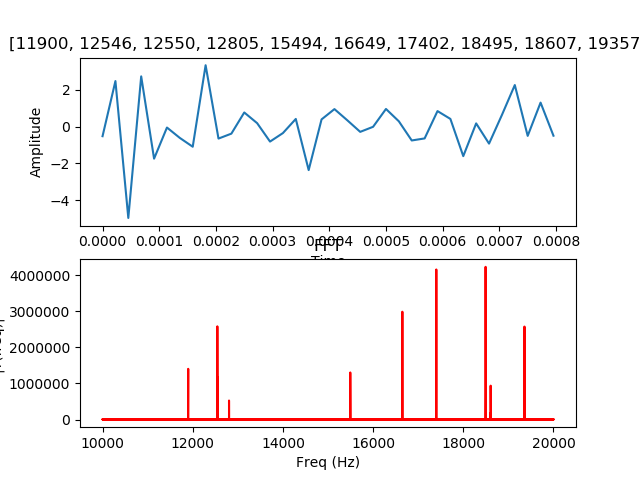

### CNNs in the Frequency Domain

&nbsp;

### Motivation and Background...

*

&nbsp;

### Investigation...

*

&nbsp;

### Start the EDA...

&nbsp;

### Graphing by the 1000's...
<table>
</table>

&nbsp;

### Gathering Data...

&nbsp;

### Results...

&nbsp;

### Looking Ahead...

&nbsp;

### Data Sources...
Many Thanks to:
