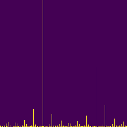

### CNNs in the Frequency Domain

### Motivation...
Some biological sensory systems measure  and transmit environmental data in frequency-dependent representations.  The auditory system in humans, for example, includes a structure in which changes in air pressure cause a resonant response at different physical locations.  Because of this, tiny hairs located at different locations move in response to specific sound frequencies, and thus trigger responses to specific nerves.  This means that the brain essentially receives its auditory information in the frequency domain.  
<table><tr><td>

 &nbsp; --hyperphysics.phy-astr.gsu.edu
</td></tr></table>

Similarly, sensory neurons in the skin which detect relative temperature fire at a rate proportional to temperature difference.  Larger temperature differences (either hotter or colder) result in faster firings, again resulting in frequency information being sent to the brain.

**For some reason, Nature has chosen to process certain inputs in frequency space.  Might this suggest an inherent efficiency for processing periodic signals in frequency space?**

### ...and some mathematical Background
In the early 1800's, Jean-Baptiste Joseph Fourier published work on the transfer of heat in which he claimed that any function can be represented  as a summation of a series of weighted sinusoids.  This mathematical concept has become widely used in the natural sciences as well as the engineering world.

As an example, a square wave can crafted by summing a very specific combination of sinusoids:
 
<table border='none'><tr>
<td></td>
<td></td>
</tr><tr><td colspan=2>&nbsp;--wikimedia.org</td>
</tr></table>

As the graphs in each pane represent the same information, we can view the Fourier Transform as an operation that transforms a function of time (here, a square wave), to a function of frequency (delta functions of varying amplitudes.)

The **<i>Fast Fourier Transform</i>** (or FFT), is a particularly efficient algorithm for computing a close-enough set of frequency/amplitude values.  Numpy has a built-in function call that we can use to easily obtain FFT transformations of data.

Since data with periodicity is identifiable when represented in frequency space, we wondered: **might a CNN might more easily recognize patterns when the data is presented following its Fourier Transformation?**  After significant prodding by the higher-ups, we settled on the problem of categorical classification for square waves and sawtooth waves.
### Making the Data...
We made a collection of square waves and sawtooth waves, and added random noise to make them tougher for the network to identify:

<table><tr>
<td></td>
<td></td>
</tr><tr>
<td></td>
<td></td>
</tr></table>

We next constructed numpy arrays that would serve as image data for the CNN (sawtooths above, squares below):
<table><tr>
<td></td>
<td></td>
<td></td>
<td></td>
<td></td></tr>
<tr>
<td>
11025 Hz
</td>
<td>
12385 Hz
</td>
<td>
12716 Hz
</td>
<td>
15391 Hz
</td>
<td>
18736 Hz
</td>
</tr><tr>
<td> </td>
<td> </td>
<td> </td>
<td> </td>
<td> </td>
</tr></table>

### The CNN and training...

We sent smaller versions of these images (64 x 64) into a CNN modeled after the cat - dog binary classifier that we used in class.  The final configuration consisted of 32 convolution layers using a 3x3 filter and RELU activation.  Pooling was set to 2x2.  A Dropout rate of 10% allowed the loss to continue decreasing with minimal oscillation for 25+ epochs.  Next, the Flattened layer interfaced with a Dense layer of 128, also with RELU activation. A final Dense layer was activated with SIGMOID.

We trained the network on 10,000 images and tested on 2,000.  Both collections contained equal samples of each category.  Also, we did include data augmentation the form of shear, zoom and horizontal flip.

We settled on 'adam' as the optimizer, since it resulted in the greatest accuracy as well as a continuously decreasing loss metric; the loss generally continued converging even after 25 epochs when the other hyperparameters approached optimal values.  The loss was calculated using binary crossentropy.   

 The results of the best run settled at over 99% accuracy.  Clearly, we didn't test the model with a tough enough data set!
<table><tr>

The increase the challenge, we shrunk the frequency range and added twice as much random noise to the sample.  In these larger images, we can see the effects of the noise as it visibly spreads across every frequency, and we see that formerly readily-identifiable distinguishing patterns between sawtooth and square waves of equal frequency have become obscurred.
<td></td>
<td>
<td>
<td>
<td></tr>
<tr>
<td>
2195 Hz
</td>
<td>
2319 Hz
</td>
<td>
3445 Hz
</td>
<td>
3691 Hz
</td>
<td>
4874 Hz
</td></tr>
<tr>
<td> </td>
<td> </td>
<td> </td>
<td> </td>
<td> </td>
</tr></table>

&nbsp;
Below are the image samples sent to the model in their actual size:
<table>
<tr colspan = 10>
<td></td>
<td></td>
<td></td>
<td></td>
<td></td>

<td></td>
<td></td>
<td></td>
<td></td>
<td></td></tr>
<tr colspan = 10>
<td></td>
<td></td>
<td></td>
<td></td>
<td></td>

<td></td>
<td></td>
<td></td>
<td></td>
<td></td></tr>
</table>

Final results of the initial phase of this study show that CNNs can categorize periodic waveforms when they are represented in frequency space.  The graphs below represent the results from the best run of the "extra dirty" dataset.  It took many more passes to achieve 95% accuracy.  Tuning of the hyperparameters also required more finesse, as the network might not barely reach 85% accuracy when even one parameter was slightly off the mark.
<table><tr>
<td></td>
<td></td>
</tr></table>

### Immediate Next Steps...
==> Send the data as prepared in the original time domain and see how well a CNN can classify.

==> Generate other periodic functions and attempt multi-class classification in both the time and frequency domains.

==> Expand the scope to study representations of data in two dimensions, such as images.

&nbsp;

### Many Thanks to...
Frank, Kelly, Mike, Erin, Alan and all of the adjunct lecturers for their sharing of wisdom, insight, encouragement and laughter.  And thanks, Angela, for the cover letter extension!

Thanks to y'all, the g80s cohort, for fielding a ton of rookie-level questions.

Extra thanks to those gurus who assembled Keras and thought up the Sequential model construction.
