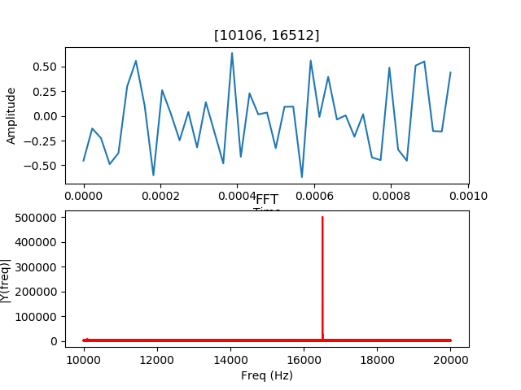
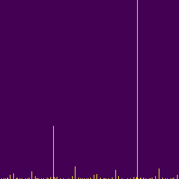
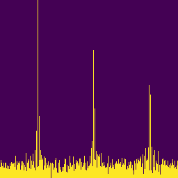

### CNNs in the Frequency Domain

&nbsp;

### Motivation and Background...
Certain biological systems measure and calculate responses after transforming the environmental signals from time-dependent to frequency-dependent representations.  The auditory system in mammals, for example, includes a structure in which changes in air pressure cause a resonant response at different physical locations.  As such, the tiny hairs located at a given location will move in response to a specific sound frequency.  As the hair movements trigger a response to different nerves, the brain essentially receives auditory information in the frequency domain.  

Similarly, sensory neurons in the skin which detect relative temperature fire at a rate proportional to the temperature difference; high difference (hot or cold) from their previous state results in faster firings.

**For some reason, Nature has chosen to process certain inputs in frequency space.  And perhaps there is a built-in efficiency that we can exploit for more general signal processing.**

<table><tr>
<td></td>
<td>
<td>
<td>
<td></tr>
<tr>
<td>
11025 Hz
</td>
<td>
12385 Hz
</td>
<td>
12716 Hz
</td>
<td>
15391 Hz
</td>
<td>
18736 Hz
</td></tr>
<tr>
<td> </td>
<td> </td>
<td> </td>
<td> </td>
<td> </td>
</tr></table>

&nbsp;
<table><tr>
<td></td>
<td>
<td>
<td>
<td></tr>
<tr>
<td>
2195 Hz
</td>
<td>
2319 Hz
</td>
<td>
3445 Hz
</td>
<td>
3691 Hz
</td>
<td>
4874 Hz
</td></tr>
<tr>
<td> </td>
<td> </td>
<td> </td>
<td> </td>
<td> </td>
</tr></table>

&nbsp;

<table>
<tr colspan = 10>
<td></td>
<td></td>
<td></td>
<td></td>
<td></td>

<td></td>
<td></td>
<td></td>
<td></td>
<td></td></tr>
<tr colspan = 10>
<td></td>
<td></td>
<td></td>
<td></td>
<td></td>

<td></td>
<td></td>
<td></td>
<td></td>
<td></td></tr>
</table>'
### Investigation...
Step 1 is EDA.
No datasets, so generate sine waves and make them dirty.
<src = 'clean sine wave'>   ==>  <src='dirty sine wave'>
<src = 'clean sine waves'>  ==>  <src='dirty sine waves'>

Sent these into Fast Fourier Transform function.
fourier = np.fft.fft(wave)
<src = 'ft of 1 sine'>  ==> <src = 'ft of higher f'>
<src = 'ft of 1 dirty'> ==> <src = 'ft of many dirty fs'>

Looked hopeful that we can extract information if we analyze data in the frequency space and then perform some type of identification/categorization using a convolutional neural network.

Bossman kept asking for a target... what is the plan here?

Scipy.signal can generate two other periodic waveforms out of the box:
sawtooth 
square 

Just to be a little fair:  make them dirty

Goal: Train a CNN to recognize and perform binary categorization of sawtooth and square waves that have been transformed to the frequency domain.  

More explicitly, use a 2-D image representation of the waveform {what you see above}.  

Task: create the square and sawtooth FFT data.  
Pick a square image size (ie 64 x 64).
Shrink down the FFT values array to *image size* entries by summing adjacent values.
Standardize by normalizing and multiplying by *image size*.
Turn this smaller array into horizontally stacked columns filled from the bottom with ones to height proportional to the value; pad remainder of array with zeros.
Save each image.  
Ultimately create 5000 samples of each type for training, and 1000 of each type for testing.

The CNN:
Started with a CNN modeled from the cat-dog classifier from class.  Used "flow_from_directory" to keep process standardized during the process of choosing image and sample sizes.

Added ImageDataGenerator to augment the dataset.  
Conv2D with 32 layers, RELU activation
(3x3) & (4x4) filters, depending on dataset under test;
MaxPooling2D pool_size = 2x2
Dropout .1 - .25 for best performance (loss downward)
Flatten
Dense = 128 with RELU
Dense final with SIGMOID
Optimizer = adam; loss = binary_crossentropy

Performance:
Ran 30 epochs on 10k image train, 2k test.  Reached 99% accuracy, ~20 epochs; loss continued to slowly drop.
Saw damped oscillatory pattern as accuracy continued to climb.

def sine(f, t):
    return np.sin(2*np.pi*f*t)

def sawtooth(f, t):
    return sg.sawtooth(2*np.pi*f*t)

def square(f, t):
    return sg.square(2*np.pi*f*t)

==>
*

&nbsp;

### Start the EDA...

&nbsp;

### Graphing by the 1000's...
<table>
</table>

&nbsp;

### Gathering Data...

&nbsp;

### Results...

&nbsp;

### Looking Ahead...

&nbsp;

### Data Sources...
Many Thanks to:
